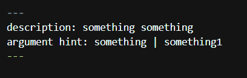

## Installation
`npm install -g @anthropic-ai/claude-code`
This will install claude code on your system

### to start using claude code
`cd your-project
claude`
This will enable claude code in your project and you can use it to do various tasks

#### 1. Debug and fix your issues
#### 2. Automate tasks that take time are and not worth wasting time on.
#### 3. Build features from descriptions 
#### 4. Navigate code base with the MCP

It works in the terminal helping developers not switch tabs XD

There are multiple Slash commands that come with claude-code
To setup in the terminal we would first use
`/terminal-setup`

## Init
`/init` - Initialize a new CLAUDE.md with codebase documentation.

CLAUDE.md with have the codebase documentation when we run /init with the latest remarks, but if there is a change in the packages, project sturcture or anything that bothers the claude, it should be updated for better output.

## Hash
while interacting with the claude via terminal, if we want to provide some rules or remark that needs to be stored in the CLAUDE.md either locally or repo level, we might enter it using a `#`
Example
`# when making new page components, always add a link to that page in the header`
Using # it will know that it has to store it in the markdown, but will ask whether in Project memory(CLAUDE.md) or local memory of project (CLAUDE.local.md) or user memory (.claude/CLAUDE.md)

## Memory
`/memory`
Used to edit memory files present in the project
#### Project memory(CLAUDE.md)
#### local memory of project (CLAUDE.local.md)
#### user memory (.claude/CLAUDE.md)

## Context
Giving context to claude helps getting better results as the section of code it has to work in gets clearer.
We can provide the context by tagging the files/folders available in the project. We can tag them using `@`.
Example
`@src\components\buttons\` this will set the folder buttons in `src\components\` as context.
likewise
 `@src\components\buttons\buttons.js` this will set the file buttons.js in `@src\components\buttons\` as context.

 ### How to keep context clean
 #### 1. Provide only necessary files and avoid unnecessary context.
 #### 2. `/exit` - exits the chat session completely.
 #### 3. `/clear` - clears the entire session context completely and chat history.
 #### 4. `/compact` - compacts the chat & context into a small summary.
 #### 5. Press ESC twice - Rewind to a previous point in the session.

 ### Context Window
 #### Claude code can handle 200K tokens worth of context, where 1 token is 3-4 characters in a word.
 #### Efficiency of claude code drops as the context window fills, so to clean the context, use the methods given above.

 ## Tools
 ### Claude can do multiple types of tasks with the following tools:
 #### Bash
 #### Edit
 #### Glob
 #### grep
 #### LS
 #### MultiEdit
 #### NotebookEdit
 #### NotebookRead
 #### Read
 #### Task
 #### TodoWrite
 #### WebFetch
 #### WebSearch
 #### Write

 ## Planning
Planning is when claude puts together its plan of action on how intense to implement some features and asks you to approve it.

we can switch to plan mode using 'alt + m'
This will help interacting with discussions with claude and then it will give its solution, which then can be corrected like an response and we can give the permission for the relevant change scope.

It is ideally preferred where the scope is bigger, logic is smaller and we need to apply changes at scale.

 ## Thinking
 When we ask claude code to think about solutions before writing any code.

This would also work in the plan mode like the Planning section
but here the prompt should have keywords like Think hard, implement, etc.
Where it should be self explanatory but well communicated that this problem statement needs thinking

It is ideally preferred where the logic is tough, thinking is required, scope doesnt matter, the code can be small, the changes might not be applied to every file but the logic impacts the overall performance of the site.

### Key
'Think hard' would trigger more thinking than 'Think', it would trigger smaller amount of thinking and reasoning

we can use 'Think harder' to get more thinking and reasoning and 
'ultrathink' to get the most thinking

But this will proportionally use the tokens.

## Slash Commands (Commands)
We have already seen multiple commands above that help in improving the overall productivity and efficiency of claude code, example - /init, /terminal-setup, /clear, /exit, /compact, /memory

When we type / on the claude terminal, we see a list of commands available to us by default from the claude, but we can also make our own custom commands.

There are multiple commands that claude provides with a small description of what it does always there, so i will only write, that are frequently used.

#### 1. `/model` - choose between various models in claude
#### 2. `/permissions` - choose the changes that you want to allow claude to do automatically and thereafter you it wont ask again for the same in the chat, where as you may remove or add permissions manually inside the settings.local.json for claude permissions in .claude/ directory inside the project.

### Custom commands
we create custom command to reduce the writing of similar tasks, like giving a context, approach, color grade, for example when we build some frontend component, we are working in same directory, with similar css, so we need not write the context and UI again and again, we may just store it in some custom command

to create a custom command-
#### 1. create a commands folder inside .claude/
#### 2. create a markdown file (.md) named after the desired command name, example ('ui-component.md')
#### 3. Inside the markdown file we made add the details desiredd for example task, variants, testing
#### 4. Run it using /component-name and then one can specify what needs to be done ahead, otherwise it would let the AI decide what is ideal in the current scenario and will make changes accordingly

To make custom commands more functional we can pass arguments, example parse $Argument and then later the task which is all mentioned in the markdown, this can be then called with the command name and an argument can be passed. We can store the passed argument in the markdown or basically the custom command using `[var-name] ` inside the markdown file
Likewise
we can also supply meta data on the top in the form of front data, which markdown allows us to add
Example

which looks like 

---
description: something something
argument hint: something | something1
---

When we make changes to the custom command file (markdown file), we need to restart the session to experience the changes using /exit